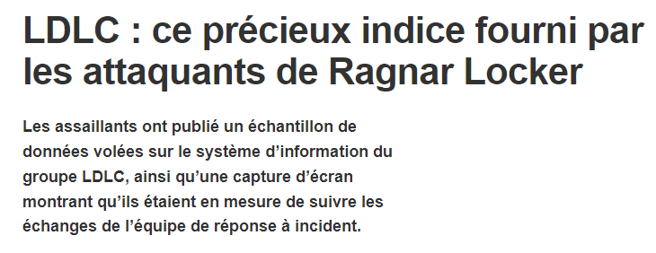
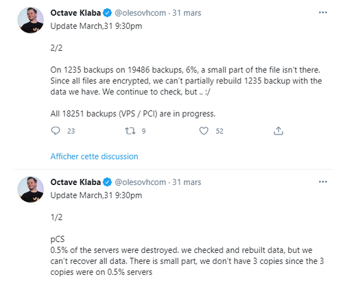

- [Definitions](#definitions)
- [To note](#to-note)
- [Prepare](#prepare)
  - [Inventory of your resources](#inventory-of-your-resources)
  - [Communication channels](#communication-channels)
  - [Insurance](#insurance)
    - [Are you protected?](#are-you-protected)
    - [Maximum support?](#maximum-support)
    - [Partners](#partners)
  - [Tools](#tools)
    - [Hardware](#hardware)
    - [CAINE Linux](#caine-linux)
    - [TSURUGI Linux](#tsurugi-linux)
    - [Scripts](#scripts)
      - [Forensicator](#forensicator)
      - [Netstat with timestamps](#netstat-with-timestamps)
    - [Mandiant RedLine](#mandiant-redline)
    - [Velociraptor](#velociraptor)
  - [Translation of business processes into IT processes](#translation-of-business-processes-into-it-processes)
- [Prepare response cells](#prepare-response-cells)
  - [Management Cell](#management-cell)
    - [Role](#role)
    - [Members](#members)
    - [End of crisis](#end-of-crisis)
  - [Ops Cell](#ops-cell)
    - [Role](#role-1)
    - [Members](#members-1)
- [Expected from the Operational cell](#expected-from-the-operational-cell)
  - [Identify the source of compromise](#identify-the-source-of-compromise)
  - [Date of initial compromise](#date-of-initial-compromise)
  - [Indicators of Compromise](#indicators-of-compromise)
  - [Rebuild the new infra](#rebuild-the-new-infra)
  - [Hardenning](#hardenning)
- [Backups](#backups)
  - [Rule of 3-2-1](#rule-of-3-2-1)
    - [Explanations](#explanations)
      - [Three copies](#three-copies)
      - [Two supports](#two-supports)
      - [Offsite Backup](#offsite-backup)
  - [Rule of 3-2-1-1-0](#rule-of-3-2-1-1-0)
    - [Explanations](#explanations-1)
      - [One offline copy](#one-offline-copy)
      - [0 error while restoring](#0-error-while-restoring)
- [Alert the authorities](#alert-the-authorities)
- [Alert your partners](#alert-your-partners)
- [End of crisis](#end-of-crisis-1)
  - [Destruction or preservation of traces](#destruction-or-preservation-of-traces)
  - [Oversight](#oversight)
  - [Service providers](#service-providers)

# Definitions
It is important to understand that there is no fixed definition of a cyber crisis.
Each organization will define what for it is a crisis, in general it takes a strong impact on production to put itself in a crisis situation.

Several standards related to crisis and security incident management:
* NIST SP 800-34 : gestion de crise
* ISO 27035 : gestion des incidents de sécurité
* ISO 22301 : système de management de la continuité d’activité

# To note
*A cyber crisis will not only impact IT staff and is not necessarily a purely technical issue.
* When it comes to ransomware on your fleet, the crisis won't be resolved in four hours.
* You will need certain information, which may take a long time to acquire.
* In some cases, deadlines are incompressible. If you have to manually intervene on a server in a remote DC, the travel time is incompressible.

# Prepare
One of the first things to do and to properly prepare for a cyber crisis.
For this, we will see several points of attention to prepare upstream.

## Inventory of your resources
It is important to have a list of your available resources in the event of a crisis, both material and personal.
* Do you have dedicated positions for incident response?
* Do you have trained staff?
* Do the personnel who will be called upon have any requirements (such as children brought and brought from school)?

## Communication channels
If your infrastructure is compromised, it is necessary to provide a secure exchange channel unrelated to your infrastructure.
A good example of the risk of using compromised infrastructure for your crisis unit: [LDLC](https://www.lemagit.fr/actualites/252510426/LDLC-ce-precieux-indice-fourni-par-les-attaquants-de-Ragnar-Locker)

_It is possible to rent dedicated rooms for discussions over short periods of time._

## Insurance
One of the crucial points often referred to at the end of remediation is insurance.

### Are you protected?
The first thing to know is if you are covered for crises of cyber origins, and if so, how high.

### Maximum support?
Another important point to validate with your insurance is to define what is covered.
Very often, the insurer will only cover the costs for a return to normal and not the costs of improvements, special charges (staff overtime, purchase of equipment, etc.)

### Partners
Finally, see with your insurance if it has dedicated partners for dedicated responses to cyber crises.
This is a crucial point, some insurance may not be activated if your service providers are not partners with your insurance.

## Tools
In order to respond effectively, it is necessary to have the tools available (USB key, on a dedicated workstation outside the network).
Here is a non-exhaustive list of tools that can help you.

### Hardware
Having write blockers available is a plus.

### CAINE Linux
Italian live Linux distribution managed by Giovanni "Nanni" Bassetti. The project started in 2008 as an environment supporting digital forensics and incident response, with several related tools pre-installed.

### TSURUGI Linux
Tsurugi Linux is a DFIR open source project that is and will be totally free, independent, without involving any commercial brand
Our main goal is share knowledge and "give back to the community"

### Scripts
#### Forensicator
This script automates the collection of information using tools like winpmem and more.

[Forensicator](https://github.com/Johnng007/Live-Forensicator) 

#### Netstat with timestamps
This script allows you to see the connections but with the indication of the timestamps.
A must have!

[Netstat](https://github.com/gtworek/PSBits/tree/master/NetstatWithTimestamps)

### Mandiant RedLine
Mandiant's free Redline tool enables rapid RAM analysis by integrating indicators of compromise (IOC) performed using Mandiant's free IOC Editor tool.

[Redline](https://fireeye.market/apps/211364)

### Velociraptor
Velociraptor is a far too underrated tool.
It allows, among other things, to retrieve information on workstations such as CPU and RAM consumption, but also to carry out investigations from its interface in order to check the content of prefetches, event log, extract RAM, etc.

[Velociraptor](https://velociraptor.velocidex.com)

## Translation of business processes into IT processes
A point often discovered during a crisis is the inability to translate a business need into an IT process.
For example, if you have to rebuild the billing department urgently, do you know what the prerequisites are for your software, where are your servers installed, in what order should they be reassembled, ports used?
It is important to carry out this part at least on the key activities of your company.

Take the case of a factory, it is always possible to deliver the components via trolleys pulled by a human while managing the robots will necessarily require a server, its database, its administration network.

# Prepare response cells
As announced at the beginning, a response to a cybercrisis will not exclusively mobilize IT teams.
There will be at least two cells which will give orders, the management cell and the operational cell.

## Management Cell
### Role
This cell will decide on the priority strategic axes for the response.
It is she who will tell the Operational cell what must be restored first, she who will decide on the communication that will be made both internally and externally.

It will also be responsible for responding to the concerns of the various departments and managing the impacts of the crisis.

Exemples : 
* The production line is at a standstill, how are your employees paid during this time?
* Who will ensure the payment of overtime for the teams?
* How to communicate with customers, the press, internally?
* How to organize staff rotation?

### Members
If there is a CODIR, it is best for the management unit to be made up of the same staff as the CODIR.
They know each other, are used to working together.

### End of crisis
It is this unit that will decide, based on feedback from the Operational team, to define the end of the organization as a crisis unit.

This decision does not mean that everything is resolved but that the company resumes a "normal" rhythm.

Indeed, it is not possible to operate in "crisis" over an extended period, both for the staff (who are under great pressure) and for the good of the company (the costs accumulate quickly in managing crisis).

## Ops Cell
### Role
This cell will have to manage two fronts.
The reconstruction of a new internal infrastructure for incident response as well as the restarting of an infrastructure for business recovery, decided by the management unit.

### Members
This unit will be made up of expert and technical personnel.
The experts may be responsible for investigating the workstations to find the origin of the attack or even trace the new infrastructure, while less technically experienced personnel may be required to prepare workstations for members of other cells.

# Expected from the Operational cell
## Identify the source of compromise
The Operational cell will have the task of finding the entry point of the attacker.
It is not a question here of finding whether it is Josiane from accounting or Robert from the communication department, but of knowing how the attacker entered the network in order to plug this flaw to prevent the new infrastructure from being subject to the same vulnerability.

## Date of initial compromise
Now that we know how the attacker operates within the infrastructure, we potentially have a date when the threat appeared.
This information is very important because it makes it possible to determine which backups are compromised and which are, a priori, reliable.

## Indicators of Compromise
If we know the attack vector as well as the date of initial compromise, it becomes possible to generate indicators of compromise in order to verify that the restored backups are healthy.

## Rebuild the new infra
In parallel with the investigation, it is crucial to rebuild an infrastructure in isolation for the members of the various services.

## Hardenning
Very often, after an attack, the target realizes that his hardening was insufficient.
The operational team will then have to implement the new hardening.

# Backups
Backups allow for a potentially quicker return to normal.
Be careful, backup management is not a protection measure strictly speaking, on the other hand a faulty backup policy can lead to the end of your business.

Whether you're backing everything up internally, to the cloud, to tape, etc. it is crucial that each backup be encrypted and the keys available via a means external to your company's IT system.

## Rule of 3-2-1
Basic rule and the minimum expected for an infrastructure, the 3-2-1 rule stipulates that you must:
* have at least three copies of your data,
* store on two different supports
* including an outsourced off-site backup

### Explanations
#### Three copies
The principle is to have your data on the server and two backups.
This is to prevent a failure from rendering your backups inoperative.

#### Two supports
Here, two media should not be understood as necessarily two different physical formats (hard disk and LTO tape) but as having its backup on two different and unrelated points.
Thus, it is possible to have two copies of the backup on hard disks if both are not stored in the same datacenter, not linked via the same software RAID, etc.

#### Offsite Backup
The idea behind this request is to have a backup stored outside your building which contains the main data in order to protect against risks such as fires (ex: [OVH](https://www.developpez.com/actu/313910/Incendie-OVH-plus-d-un-millier-de-sauvegardes-ne-seront-probablement-pas-recuperables-admet-OVHcloud/) ).

Although not a recommended solution, a cloud backup, if you don't have a vault, is a solution.

## Rule of 3-2-1-1-0
This rule is to be applied at least to your company's critical resources.
Identical to the 3-2-1 rule, it adds two conditions:
* 1 offline copy
* 0 error while restoring

### Explanations
#### One offline copy
This is about having a backup that is not tied to your network and any IT infrastructure.

The goal is to avoid that if an attacker has compromised your network, he can intervene on this backup.

#### 0 error while restoring
This point seems logical, but it is advisable to regularly test the backups made and to verify that they are restorable without error.

It will be damaging if, once restored, it is discovered that a file on the database server is in fact damaged.

# Alert the authorities
Do you know who should be alerted, what is the maximum duration to warn them and who is responsible for doing so?
These points depend on your company, the standards it must meet and its location.

# Alert your partners
Keep in mind that you are not alone.
If your information system is compromised, you can become a threat to your partners interconnected to your network.
Similarly, perhaps the attacker came from one of your partner's networks and you, being more mature or luckier, detected it while your partner did not.

In any case, communicating with your partners is a good thing.

# End of crisis
## Destruction or preservation of traces
Once the end of the crisis has been decided, all decision-making documents that could contain confidential information should be deleted.

In the case of ransomware, it may be interesting to keep encrypted files on offline media in case the encryption keys leak one day.

## Oversight
At the end of the crisis, the personnel tend to relax after having been under great pressure.
It is therefore essential to supervise both your new infrastructure and the staff.

## Service providers
The service providers who have accompanied you will surely offer you to stay in contact, to sell you the "loaned" solutions for the resolution of the crisis, etc.
Take the time to reflect.
