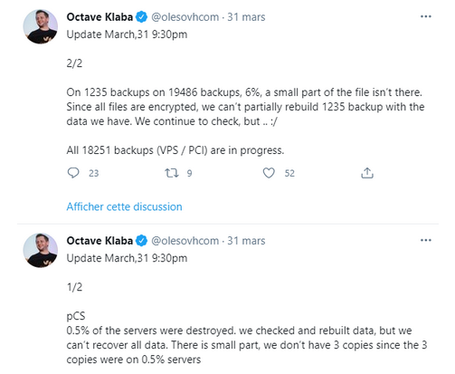

- [Définitions](#définitions)
- [A noter](#a-noter)
- [Se préparer](#se-préparer)
  - [Inventaire de vos ressources](#inventaire-de-vos-ressources)
  - [Canaux de discussions](#canaux-de-discussions)
  - [Assurance](#assurance)
    - [Etes-vous protéger ?](#etes-vous-protéger-)
    - [Prise en charge maximum ?](#prise-en-charge-maximum-)
    - [Partenaires](#partenaires)
  - [Outils](#outils)
    - [Matériel](#matériel)
    - [CAINE Linux](#caine-linux)
    - [TSURUGI Linux](#tsurugi-linux)
    - [Scripts](#scripts)
      - [Forensicator](#forensicator)
      - [Netstat avec timestamps](#netstat-avec-timestamps)
    - [Mandiant RedLine](#mandiant-redline)
    - [Velociraptor](#velociraptor)
  - [Traduction des processus métier en processus IT](#traduction-des-processus-métier-en-processus-it)
- [Préparer les cellules de réponses](#préparer-les-cellules-de-réponses)
  - [Cellule de Direction](#cellule-de-direction)
    - [Rôle](#rôle)
    - [Membres](#membres)
    - [Fin de crise](#fin-de-crise)
  - [Cellule Opérationnelle](#cellule-opérationnelle)
    - [Rôle](#rôle-1)
    - [Membres](#membres-1)
- [Attendu de la cellule Opérationnelle](#attendu-de-la-cellule-opérationnelle)
  - [Identifier la source de compromission](#identifier-la-source-de-compromission)
  - [Date de la compromission initiale](#date-de-la-compromission-initiale)
  - [Indicateurs de compromissions](#indicateurs-de-compromissions)
  - [Reconstruire la nouvelle infra](#reconstruire-la-nouvelle-infra)
  - [Durcissement](#durcissement)
- [Sauvegardes](#sauvegardes)
  - [Principes du 3-2-1](#principes-du-3-2-1)
    - [Explications](#explications)
      - [Trois copies](#trois-copies)
      - [Deux supports](#deux-supports)
      - [Une sauvegarde hors site](#une-sauvegarde-hors-site)
  - [Principe du 3-2-1-1-0](#principe-du-3-2-1-1-0)
    - [Explications](#explications-1)
      - [Une copie hors ligne](#une-copie-hors-ligne)
      - [Zéro erreur lors de la restauration](#zéro-erreur-lors-de-la-restauration)
- [Alerter les autorités](#alerter-les-autorités)
- [Alerter vos partenaires](#alerter-vos-partenaires)
- [Fin de crise](#fin-de-crise-1)
  - [Destruction ou conservations des traces](#destruction-ou-conservations-des-traces)
  - [Surveillance](#surveillance)
  - [Prestataires](#prestataires)

# Définitions
Il est important de comprendre qu'il n'y a pas de définition fixe d'une crise d'origine cyber.
Chaque organisme définira ce qui pour elle est une crise, en général il faut un fort impact sur la production pour se mettre en situation de crise.

Plusieurs normes liées à la gestion de crise et incident de sécurité:
* NIST SP 800-34 : gestion de crise
* ISO 27035 : gestion des incidents de sécurité
* ISO 22301 : système de management de la continuité d’activité

# A noter
* Une crise d'origine cyber n'aura pas d'impact uniquement sur le personnel du service informatique et n'est pas forcément un problème purement technique.
* Lorsqu'il s'agit de ransomware sur votre parc, la crise ne sera pas résolue en quatre heures.
  * Vous aurez besoin de certaines informations, dont le temps acquisition peut être long.
  * Dans certains cas, des délais sont incompressibles. Si vous devez intervenir manuellement sur un serveur dans un DC distant, le temps de trajet est incompressible.

# Se préparer
Une des premières choses à faire et de correctement se préparer à une crise cyber.
Pour cela, nous allons voir plusieurs points d'attention à préparer en amont.

## Inventaire de vos ressources
Il est important d'avoir la liste de vos ressources disponibles en cas de crise, aussi bien matériels que personnels.
* Avez-vous des postes dédiés pour la réponse à incident ?
* Avez-vous du personnel formé ?
* Les personnels qui seront sollicités ont-ils des impératifs (comme des enfants ont emmené et ramené de l'école) ?

## Canaux de discussions
Si votre infrastructure est compromise, il est nécessaire de prévoir un canal d'échange sécurisé non lié à votre infrastructure.
Un bon exemple du risque d'utiliser une infrastructure compromise pour votre cellule de crise : [LDLC](https://www.lemagit.fr/actualites/252510426/LDLC-ce-precieux-indice-fourni-par-les-attaquants-de-Ragnar-Locker)

_Il est possible de louer des salles dédiées pour les échanges sur des durées courtes._

## Assurance
Un des points cruciaux, souvent appelé à la fin de la remédiation est l'assurance.

### Etes-vous protéger ?
La première chose a savoir est si vous êtes couverts pour les crises d'origines cybers, et si oui, à quelle hauteur.

### Prise en charge maximum ?
Un autre point important à faire valider avec son assurance est de délimiter ce qui est pris en charge.
Bien souvent, l'assureur ne prendra en charge que les frais pour un retour à la normale et non les frais d'améliorations, charges particulières (heures supplémentaires du personnel, rachat de matériel, etc.)

### Partenaires
Enfin, voyez avec votre assurance s'il a des partenaires dédiés pour les réponses dédiées aux crises cybers.
Il s'agit d'un point crucial, certaines assurances peuvent ne pas s'activer si vos prestataires ne sont pas partenaires avec votre assurance.

## Outils
Afin de répondre efficacement, il est nécessaire d'avoir les outils à dispositions (clef USB, sur un poste dédié hors réseau).
Voici une liste non exhaustive d'outils pouvant vous aider.

### Matériel
Avoir à disposition des bloqueurs en écriture est un plus.

### CAINE Linux
Distribution Linux live italienne gérée par Giovanni "Nanni" Bassetti. Le projet a débuté en 2008 en tant qu'environnement favorisant la criminalistique numérique et la réponse aux incidents, avec plusieurs outils connexes préinstallés.

### TSURUGI Linux
Tsurugi Linux is a DFIR open source project that is and will be totally free, independent, without involving any commercial brand
Our main goal is share knowledge and "give back to the community"

### Scripts
#### Forensicator
Ce script permet d'automatiser la collecte d'informations en utilisant des outils comme winpmem et consort.

[Forensicator](https://github.com/Johnng007/Live-Forensicator) 

#### Netstat avec timestamps
Ce script vous permet de voir les connexions mais avec l'indication du timestamps.
Un must have !

[Netstat](https://github.com/gtworek/PSBits/tree/master/NetstatWithTimestamps)

### Mandiant RedLine
L'outil gratuit Redline de Mandiant permet une analyse rapide de la RAM en intégrant des indicateurs de compromissions (IOC) réalisées à l'aide de l'outil gratuit IOC Editor du même éditeur.

[Redline](https://fireeye.market/apps/211364)

### Velociraptor
Vélociraptor est un outil beaucoup trop sous-estimé.
Il permet, entre autres, de récupérer des informations sur les postes tels que la consommation cpu, RAM mais aussi réalisé des investigations depuis son interface afin de vérifier le contenu des prefetchs, event log, extraire la RAM, etc.

[Velociraptor](https://velociraptor.velocidex.com)

## Traduction des processus métier en processus IT
Un point souvent découvert lors d'une crise est l'incapacité à traduire un besoin métier en processus informatique.
Par exemple, s'il faut reconstruire en urgence le service de facturation, savez-vous qu'elles sont les prérequis à vos logiciels, où sont installés vos serveurs, dans quel ordre ils doivent être remontés, ports utilisés ?
Il est important de réaliser cette partie a minima sur les activités-clefs de votre entreprise.

Prenons le cas d'une usine, il est toujours possible de livrer les composants via chariots trainés par un humain alors que gérer les robots nécessitera forcément un serveur, sa base de données, son réseau d'administration.

# Préparer les cellules de réponses
Comme annoncé au début, une réponse à crise d'origine cyber ne va pas mobiliser exclusivement les équipes informatiques.
Il y aura au moins deux cellules qui donneront des ordres, la cellule de direction et la cellule Opérationnelle.

## Cellule de Direction
### Rôle
Cette cellule décidera des axes stratégiques prioritaires pour la réponse.
C'est elle qui dira à la cellule Opérationnelle ce qui doit être restauré en premier, elle qui décidera de la communication qui sera faite aussi bien en interne qu'en externe.

Elle aura aussi pour mission de répondre aux inquiétudes des différents services et gérer les impacts de la crise.

Exemples: 
* la chaine de production est au arrêt, comment se passe la paie de vos salariés pendant ce temps ? 
* Qui va veiller aux paiement des heures supplémentaires des équipes ? 
* Comment communiquer auprès des clients, de la presse, en interne ? 
* Comment organiser la rotation des personnels ?

### Membres
S'il existe un CODIR, le mieux est que la cellule de direction soit constitué des mêmes personnels que le CODIR.
Ils se connaissent, ont l'habitude de travailler ensemble.

### Fin de crise
C'est cette cellule qui décidera, en fonction des remontées de l'équipe Opérationnelle, de définir la fin de l'organisation en cellule de crise.

Cette décision ne veux pas dire que tout est résolu mais que l'entreprise reprend un rythme "normal".

En effet, il n'est pas possible de fonctionner en "crise" sur une durée étendue, aussi bien pour le personnel (qui subit une forte pression) que pour le bien de l'entreprise (les frais s'accumulent vite en gestion de crise).

## Cellule Opérationnelle
### Rôle
Cette cellule devra gérer deux fronts.
La reconstruction d'une nouvelle infra interne pour la réponse à incidents ainsi que la remise en route d'une infrastructure pour la reprise d'activité, décidée par la cellule de direction.

### Membres
Cette cellule sera composée de personnels experts et techniques.
Les experts pourront être chargés d'investiguer sur les postes pour trouver l'origine de l'attaque ou encore remonter la nouvelle infrastructure alors que les personnels moins aguerris techniquement pourront être amenés à préparer des postes pour les membres des autres cellules.

# Attendu de la cellule Opérationnelle
## Identifier la source de compromission
La cellule Opérationnelle aura pour mission de trouver le point d'entrée de l'attaquant.
Il ne s'agit pas ici de trouver s'il s'agit de Josiane de la comptabilité où Robert du service communication mais de savoir comment l'attaquant est entré dans le réseau afin de colmater cette faille pour éviter que la nouvelle infrastructure ne soit assujettie à la même vulnérabilité.

## Date de la compromission initiale
Maintenant que nous savons comment l'attaquant à opérer au sein d'infrastructure nous avons potentiellement une date d'apparition de la menace.
Cette information est très importante car elle permet de déterminer quelles sauvegardes est compromise et lesquels sont, a priori, fiables.

## Indicateurs de compromissions
Si nous connaissons le vecteur d'attaque ainsi que la date de compromission initiale, il devient possible de générer des indicateurs de compromission afin de vérifier que les sauvegardes restaurées soient saines.

## Reconstruire la nouvelle infra
En parallèle de l'investigation, il est crucial de reconstruire une infrastructure en vase clos pour les membres des différents services.

## Durcissement
Très souvent, après une attaque, la cible se rends compte que son durcissement était insuffisant.
Il faudra alors que l'équipe opérationnelle mette en œuvre le nouveau durcissement.

# Sauvegardes
Les sauvegardes permettent un retour potentiellement plus rapide à la normale.
Attention, la gestion des sauvegardes n'est pas une mesure de protection à proprement parler, en revanche une politique de sauvegarde défaillante peut entrainer la fin de votre entreprise.

Que vous sauvegardez tout en interne, sur le cloud, sur bande, etc. il est crucial que chaque sauvegarde soit chiffrée et les clefs disponibles via un moyen externe au système informatique de votre entreprise.

## Principes du 3-2-1
Règle de base et le minimal attendu pour une infrastructure, la règle des 3-2-1 stipules que vous devez :
* disposer de trois copies de vos données au moins,
* stocker sur deux supports différents
* dont une sauvegarde externalisée hors site

### Explications
#### Trois copies
Le principe est d'avoir votre donnée sur le serveur et deux sauvegardes.
Ceci a pour but d'éviter qu'une panne rende inopérantes vos sauvegardes.

#### Deux supports
Ici, il ne faut pas comprendre deux supports comme forcément deux formats physiques différents (disque dur et bande LTO) mais comme avoir sa sauvegarde sur deux points différents et non liés.
Ainsi, il est possible d'avoir deux copies de la sauvegarde sur disques durs si les deux ne sont pas stockés dans le même datacenter, non liés via le même RAID logiciel, etc.

#### Une sauvegarde hors site
L'idée derrière cette requête est d'avoir une sauvegarde stockée en dehors de votre bâtiment qui contient la donnée principale afin de se prémunir des risques tel que les incendies (ex: [OVH](https://www.developpez.com/actu/313910/Incendie-OVH-plus-d-un-millier-de-sauvegardes-ne-seront-probablement-pas-recuperables-admet-OVHcloud/) ).

Bien que ce ne soit pas une solution recommandée, une sauvegarde dans le cloud, à défaut d'un coffre-fort, est une solution.

## Principe du 3-2-1-1-0
Cette règle est à appliquer a minima sur les ressources critiques de votre entreprise.
Identique à la règle du 3-2-1 elle ajoute deux conditions : 
* 1 copie hors ligne
* 0 erreur lors de la restauration

### Explications
#### Une copie hors ligne
Il est ici question d'avoir une sauvegarde qui n'est pas reliée à votre réseau et de toute infrastructure informatique.

Le but est d'éviter que si un attaquant a compromis votre réseau, il puisse intervenir sur cette sauvegarde.

#### Zéro erreur lors de la restauration
Ce point semble logique, mais il convient de tester régulièrement les sauvegardes réalisées et de vérifier qu'elle soit restaurable sans erreur.

Il sera dommageable qu'une fois restauré, on découvre qu'un fichier du serveur de base de données soit enfaité endommager.

# Alerter les autorités
Savez-vous qui doit être alertés, quelle durée maximale pour l'avertir et qui se charge de la faire ?
Ces points-là dépendent de votre entreprise, des normes que celle-ci doit respecter et de sa localisation.

Quelques exemples : 
* Une ESN a 24h pour prévenir l'ANSSI d'une cyberattaque contre elle ([source](https://www.solutions-numeriques.com/les-entreprises-de-services-numeriques-devront-prevenir-lanssi-sous-24h-si-elle-subissent-une-cyberattaque/))
* Vous avez 72h max pour prévenir la CNIL d'une fuite de données ([source](https://www.cnil.fr/fr/cnil-direct/question/reglement-europeen-quand-faut-il-notifier-une-violation-de-donnees-la-cnil#:~:text=Vous%20devez%20le%20notifier%20à,l%27incident%20aux%20personnes%20concernées.))

# Alerter vos partenaires
Garder en tête que vous n'êtes pas seuls.
En cas de compromission de votre système d'information, vous pouvez devenir une menace pour vos partenaires interconnectés à votre réseau.
De la même manière, peut-être que l'attaquant vient du réseau d'un de vos partenaires et que vous, en étant plus mature ou plus chanceux, vous l'avez détecté alors que votre partenaire non.

Dans tous les cas, communiquer auprès de vos partenaires est une bonne chose.

# Fin de crise
## Destruction ou conservations des traces
Une fois la fin de crise décidée, il convient de supprimer tous les documents de prise de décision qui pourraient comporter des informations confidentielles.

Dans le cas de ransomwares, il peut être intéressant de conserver sur un média déconnecté les fichiers chiffrés au cas où un jour les clefs de chiffrement fuitent.

## Surveillance
À la sortie d' crise, les personnels ont tendance à se relâcher après avoir subi une grosse pression.
Il est donc primordial de superviser aussi bien votre nouvelle infrastructure que le personnel.

## Prestataires
Les prestataires vous ayant accompagné vont surement vous proposer de rester en contacts, de vous vendre les solutions "prêté" pour la résolution de la crise, etc.
Prenez bien le temps de la réflexion.
